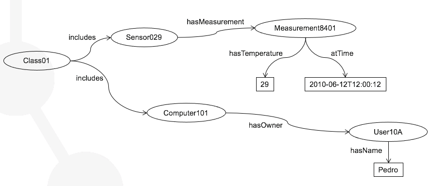

# Semantic Web, Linked Data, and Knowledge Graphs 2020-2021

This is the repository that we will use for our collaborative work and for uploading all the assignments for our course.

This is the normal process that you will have to follow in order to interact with the repository:

* Fork the main repository into your own account (this will generate a new repository in your GitHub account). This is done only once during the course. 
* If you had already forked the repository some time ago, you may want to sync your repository to the latest version that is now available. This is done by [configuring the remote for a fork](https://help.github.com/articles/configuring-a-remote-for-a-fork) and [syncing your fork](https://help.github.com/articles/syncing-a-fork). Basically, you have to:
 * Establish remote: 
 
        git remote add upstream https://github.com/AndreaCimminoArriaga/LinkedData2021-2022

 * Fetch any changes to it: 
 
        git fetch upstream
 
 * Checkout the local main branch of your fork: 
 
        git checkout main
 
 * Merge changes from the remote into your main branch: 
 
        git merge upstream/main

* Make any changes to your repository, according to the specific assignment
* Commit your changes into your local repository
* Push your changes to your online repository
* Make a pull request, so that we can check your changes and accept them into the master of the general repository. If everything is ok, your changes will be incorporated into the main repository. If not, you will receive a message of why not.

**Assignment 1**. Please fill in a line with a dataset description at folder [Assignment 1](./Assignment1/DatasetDescriptions.csv), as discussed in the course moodle site, and make a pull request

**Assignment 2a - Exercise on RDF and RDFS**. Upload an image with the graph described in the [StickyNote_PureRDF.rdf](./Assignment2/StickyNote_PureRDF.rdf) file, and comment on those from your colleagues (if you wish), creating issues in the GitHub repository. Additionally, upload a *.ttl* file with RDF instantiating the  shown in the slides. Both files must be uploaded in the [Assignment2](./Assignment2/) folder, **using your GitHub username - your NameSurname** + (.png/.svg) and (.rdf/.ttl), or any other similar file extension.

For example, I (my Github username is 'AndreaCimminoArriaga') would upload two files :
* ocorcho-OscarCorcho.png (the image, Exercise 1.a) 
* ocorcho-OscarCorcho.ttl (Exercise 1.b in Turtle).

